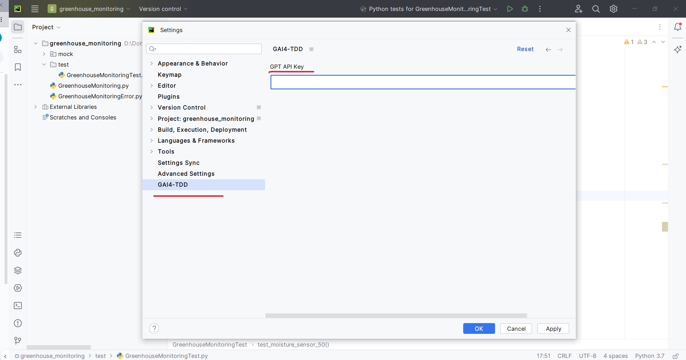
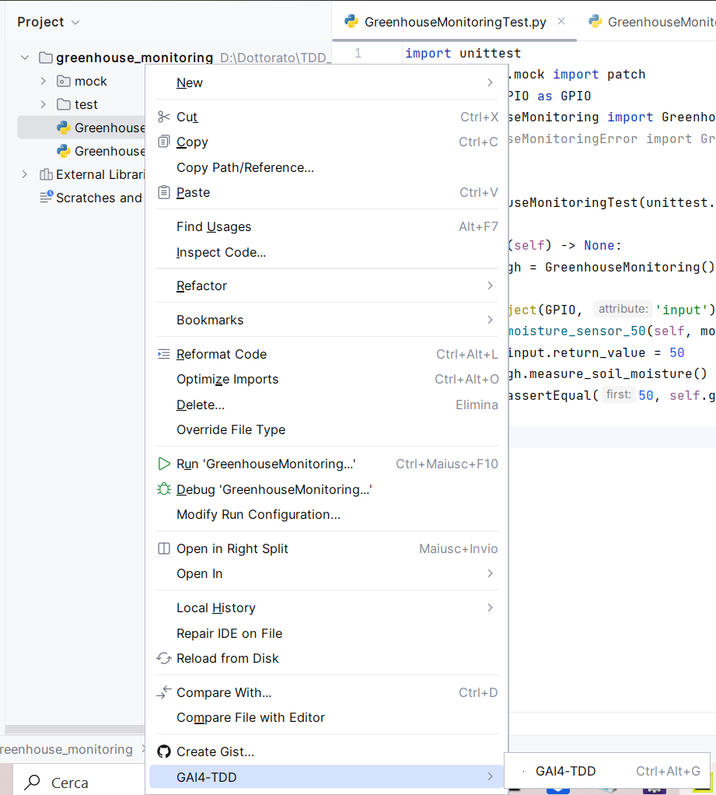
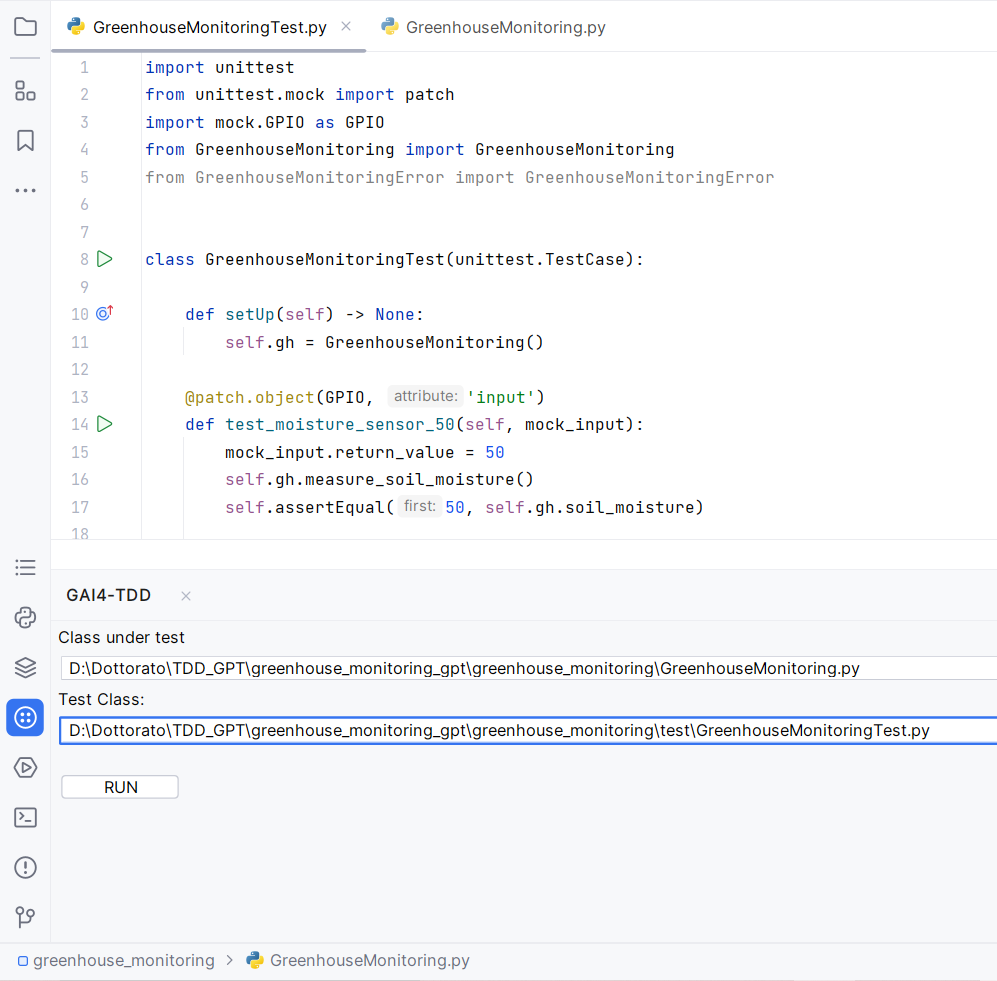
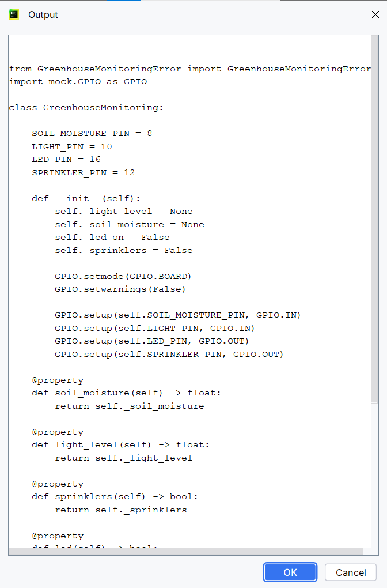

GAI4-TDD
========

GAI4-TDD (Generative Artificial Intelligence for Test-Driven Development) isa PyCharm plugin to support the green phase of TDD.

Requirements
------------

*   Install Python and PyCharm;
*   Install the openai library for Python, to enable (remote) communication with the GPT-4 model;
*   Have an API key for OpenAI and sufficient credit balance to use the OpenAI APIs
*   Use unittest as a unit testing framework.
*   Python has been added to the path environment variable and the openai library has been added to the Python’s sys.path variable

How to Use
----------

1.  Install the Zip as Plugin of PyCharm and restart the IDE
2.  Open settings and set-up the OpenAI API Key like in figure 1

Fig.1 - Setting Screen

4.  Now the plugin is ready to work. During the red phase the developer behaves as usual, writing a unit test for a feature not yet developed;
5.  After writing the unit test to ensure that GAI4 takes care of the green phase, right-click on the class under test, which must contain the feature, as in figure 2 and click on GAI4-TDD

Fig.2 - Contextual Menu

7.  Upon clicking, a window will open as in figure 3. We must now enter the absolute path of the test class in the textfield called "Test Class"

Fig.3 - GAI4 window

9.  Click on "Run" button
10.  At the end of the execution a dialog will open to give us a preview of the result. If you click OK the preview will overwrite the data present in the class under test, otherwise the process will be cancelled.

Fig.4 - GAI4 dialog

Here is the video on how to install and use the tool:

[Link](https://youtu.be/3oIDb-6NgS4)